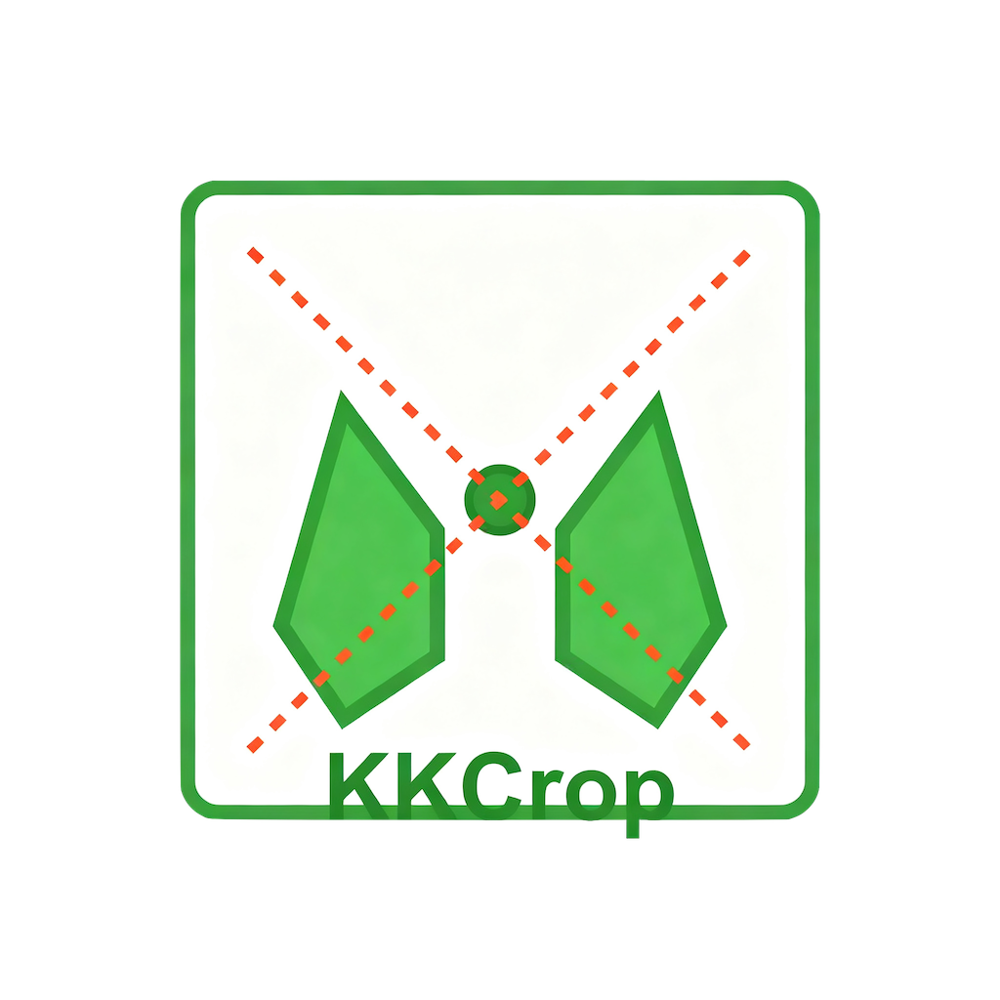

# KKCrop 图片等比分割工具

## 项目介绍 / Project Introduction

KKCrop 是一款专业的图片等比分割工具，基于 Electron 开发，支持将一张大图按照指定的行数和列数等比例分割成多个小图，并支持将分割结果保存为独立图片文件或合并为 PDF 文档。

KKCrop is a professional image splitting tool developed based on Electron, which supports splitting a large image into multiple small images proportionally according to specified rows and columns, and saving the split results as independent image files or merging them into a PDF document.



## 功能特点 / Features

### 核心功能 / Core Features
- **图片导入**：支持选择本地图片文件或通过拖放方式导入
- **灵活分割**：可自定义设置横向和纵向分割数量（1-20）
- **实时预览**：直观查看分割效果，支持缩放和平移操作
- **多格式导出**：
  - 导出为独立图片文件（保持原始格式）
  - 导出为 PDF 文档（每页一张分割图）

### 界面体验 / UI Experience
- **三步式操作**：选择图片 → 设置分割 → 预览保存
- **响应式设计**：适配不同屏幕尺寸
- **现代化界面**：基于 Tailwind CSS 的清新简约设计
- **直观交互**：拖放上传、滑块调整、即时反馈

### 技术优势 / Technical Advantages
- **高效处理**：利用 Sharp 库进行高性能图像处理
- **跨平台兼容**：支持 Windows、macOS 和 Linux 系统
- **安全稳定**：Electron 沙箱机制确保用户数据安全
- **轻量应用**：优化的资源占用，启动快速

## 技术栈 / Technology Stack

| 技术 / Technology | 用途 / Purpose | 版本 / Version |
|-------------------|----------------|----------------|
| Electron | 桌面应用框架 | 38.2.2 |
| Vite | 构建工具 | 5.4.20 |
| Tailwind CSS | UI 框架 | 3.4.17 |
| Sharp | 图像处理 | 0.34.4 |
| pdf-lib | PDF 生成 | 1.17.1 |
| Font Awesome | 图标库 | 4.7.0 |

## 安装方法 / Installation

### 预构建版本 / Pre-built Version

1. 前往 [Releases](https://github.com/yourusername/kkcrop/releases) 页面下载对应系统的安装包
2. 按照安装向导完成安装

### 从源码构建 / Build from Source

```bash
# 克隆仓库
git clone https://github.com/yourusername/kkcrop.git
cd kkcrop

# 安装依赖
npm install

# 开发模式运行
npm start

# 打包应用
npm run package

# 生成安装包（Windows）
npm run make -- --platform=win32
```

## 使用说明 / Usage

### 基本操作流程 / Basic Workflow

1. **选择图片**：点击或拖拽图片到指定区域，支持 JPG、PNG、GIF、BMP 格式
2. **设置分割参数**：通过滑块或输入框设置横向(X)和纵向(Y)的分割数量
3. **预览分割结果**：查看分割后的图片效果，可缩放和平移
4. **保存结果**：选择导出为独立图片文件或合并为 PDF 文档

### 快捷键 / Keyboard Shortcuts
- **退出应用**：`Ctrl+Q` (Windows/Linux) 或 `Cmd+Q` (macOS)
- **开发模式**：`Ctrl+Shift+I` (Windows/Linux) 或 `Alt+Cmd+I` (macOS) 打开开发者工具

## 开发说明 / Development Notes

### 项目结构 / Project Structure
```
KKCrop/
├── assets/           # 图标和静态资源
├── src/              # 源代码
│   ├── main.js       # 主进程代码
│   ├── preload.js    # 预加载脚本
│   ├── renderer.js   # 渲染进程入口
│   └── index.css     # 样式文件
├── index.html        # 主窗口HTML
├── forge.config.js   # Electron Forge配置
├── vite.*.config.mjs # Vite配置文件
└── package.json      # 项目依赖和脚本
```

### 构建配置 / Build Configuration
- 使用 Electron Forge 进行应用打包
- 支持多平台构建：Windows (squirrel), macOS (dmg), Linux (deb, rpm)
- 包含 Vite 插件以优化开发体验和构建输出

## 常见问题 / FAQ

### 支持哪些图片格式？
目前支持 JPG、PNG、GIF、BMP 格式的图片导入和处理。

### 最大可以分割成多少块？
为了保证处理效率和实用性，横向和纵向分割数量均限制在 1-20 之间。

### 为什么我的 PDF 导出包含空白页？
这可能是由于部分图片块处理失败导致的。请尝试使用格式更标准的图片文件。

## 许可证 / License

本项目采用 MIT 许可证 - 详见 [LICENSE](LICENSE) 文件

This project is licensed under the MIT License - see the [LICENSE](LICENSE) file for details.

## 联系我们 / Contact

如有问题或建议，请联系：
- 作者：昏德公
- 邮箱：691325380@qq.com